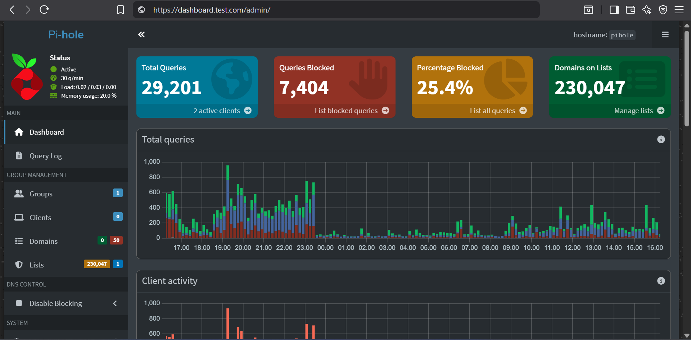

# Self-hosted Private DNS (Pi-hole + Dnsdist + Caddy)



Run your own **private DNS resolver** with advanced filtering, DNS over HTTPS (DoH), and DNS over TLS (DoT) — all in a simple Docker setup.  
Pi-hole provides customizable DNS filtering and query logging, dnsdist handles DNS/DoT/DoH backends, and Caddy manages HTTPS with automatic Let's Encrypt certificates.

## ✨ Features

- **Custom DNS filtering**: Centralized control over which domains are resolved
- **Secure DNS**: DoH at `https://<DOMAIN_DNS>/dns-query` and DoT on port `853`
- **Automatic TLS**: Caddy obtains and renews certificates via Let's Encrypt
- **Dashboard**: Full query visibility and management at `https://<DOMAIN_DASHBOARD>/admin/`
- **Persistence & health checks**: Data volumes and restart policies included

## 🔧 Prerequisites

### DNS Records

Set up **A/AAAA DNS records** pointing both domains to your server's public IP:

- `DOMAIN_DNS` → e.g., `dns.example.com`
- `DOMAIN_DASHBOARD` → e.g., `dashboard.example.com`

### Port Requirements

Ensure the following ports are available (no other services using them):

- `80, 443` → Caddy (HTTP/HTTPS)
- `53/tcp, 53/udp` → DNS (dnsdist → Pi-hole)
- `853/tcp` → DoT (dnsdist)

## 🚀 Quick Start

1. **Clone the repository:**

   ```bash
   git clone --depth=1 https://github.com/allenhack638/self-hostable-private-dns.git
   cd self-hostable-private-dns
   ```

2. **Configure environment:**

   ```bash
   cp .env.example .env
   # Edit .env with your domain names and password
   ```

3. **Start the stack:**

   ```bash
   docker compose up -d
   ```

4. ⚠️ **If you see "port 53 already in use" errors, then disable systemd-resolved:**

   ```bash
   # Stop the containers first
   docker compose down

   # Disable systemd-resolved
   sudo systemctl stop systemd-resolved
   sudo systemctl disable systemd-resolved

   # Start the stack again
   docker compose up -d
   ```

**To re-enable systemd-resolved later (if needed):**

```bash
docker compose down
sudo systemctl enable systemd-resolved
sudo systemctl start systemd-resolved
```

> **Why this order matters**: If you disable `systemd-resolved` first, your system will lose DNS resolution temporarily, preventing Docker from pulling images and Caddy from verifying certificates. Starting the stack first allows everything to download properly, then we only disable `systemd-resolved` if there's actually a conflict.

## ⚙️ Configuration

### Environment Variables

| Variable                         | Description                                       | Example                 |
| -------------------------------- | ------------------------------------------------- | ----------------------- |
| `TZ`                             | Timezone in tz database format                    | `Asia/Kolkata`          |
| `FTLCONF_webserver_api_password` | Dashboard login password (use a strong password!) | `your-secure-password`  |
| `DOMAIN_DNS`                     | Public domain for DoH/DoT (TLS via Caddy)         | `dns.example.com`       |
| `DOMAIN_DASHBOARD`               | Public domain for the dashboard                   | `dashboard.example.com` |

> **Timezone reference**: See the full list in [tz database time zones](https://en.wikipedia.org/wiki/List_of_tz_database_time_zones).

## 📡 Usage

### Service Endpoints

| Protocol  | Address / URL                       | Port |
| --------- | ----------------------------------- | ---- |
| DNS       | `<SERVER_IP>`                       | 53   |
| DoT       | `<DOMAIN_DNS>`                      | 853  |
| DoH       | `https://<DOMAIN_DNS>/dns-query`    | 443  |
| Dashboard | `https://<DOMAIN_DASHBOARD>/admin/` | 443  |

### Port Summary

| Port(s)        | Service                 |
| -------------- | ----------------------- |
| 53/tcp, 53/udp | DNS (dnsdist → Pi-hole) |
| 80, 443        | Caddy (HTTP/HTTPS)      |
| 853/tcp        | DoT (dnsdist)           |

## 💾 Data & Persistence

- **Pi-hole configuration**: Stored in `data/pihole/`
- **Caddy certificates**: Stored in `data/caddy-data/`
- **Shared certificates**: Copied to `data/shared-certs/` for dnsdist access

All data persists between container restarts and updates.

## 📜 Monitoring & Troubleshooting

### View Logs

**All services (live):**

```bash
docker compose logs -f
```

**Individual services:**

```bash
docker compose logs dns-pihole
docker compose logs dns-caddy
docker compose logs dns-dnsdist
```

### Health Checks

The stack includes built-in health checks and restart policies to ensure services stay running.

## 🙌 Credits

This project is built with these excellent open-source tools:

- [Pi-hole](https://pi-hole.net/) – Network-level DNS filtering and management
- [dnsdist](https://dnsdist.org/) – High-performance DNS load balancer with DoH/DoT support
- [Caddy](https://caddyserver.com/) – Modern web server with automatic HTTPS

## 🤝 Contributing

Issues, questions, and feature requests are welcome! Please open an issue or start a discussion in this repository.

## 📖 Advanced Configuration

Need custom configurations? I can help with:

- Custom ACLs and fine-grained access control
- Advanced dnsdist load-balancing strategies
- Conditional forwarding rules
- Integration with upstream/external resolvers
- Enterprise-grade scaling and security hardening

📬 **Contact**: [allenbenny038@gmail.com](mailto:allenbenny038@gmail.com)
